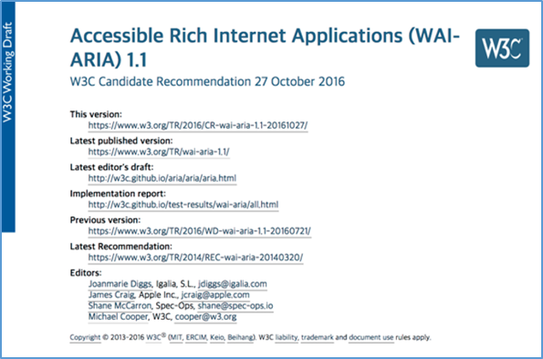
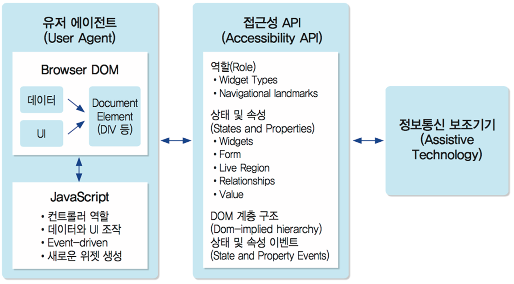

###### Session A
## WCAG v2.x 지침을 보완하는 WAI-ARIA 표준 기술에 관한 소개

**WAI-ARIA 표준 기술 소개** 및 실습 편 by 강사 [김데레사](https://github.com/seulbinim)

Session A에서는 WAI-ARIA의 기본 개념 및 기술에 대해 소개하고 WCAG 2.x 지침 준수를 위한 WAI-ARIA 적용 방법에 대해 실습합니다.

## WAI-ARIA 란?

**RIA**를 위한 접근성 권고안으로 마크업에 역할(Role), 속성(Property), 상태(State) 정보를 추가하여 스크린 리더 및 보조 기기 등에서 접근성 및 상호 운용성을 향상시키고 보다 나은 사용자 경험(User Experience)을 제공합니다.


<br>
> WAI-ARIA 1.1

<br>
> WAI-ARIA APi

## WAI-ARIA의 3가지 기능

### - 역할(Role)
- 특정 요소(Element)에 역할을 정의하는 것
- 역할을 부여하여 사용자에게 정보를 제공
- 부여된 역할은 동적으로 변경할 수 없음

```
<div class="user_menu" role="menu">...</div>
<div class="auth_error" role="alertdialog">...</div>
<div class="btn_01" role="button">...</div>
```

### - 속성(Properties)과 상태(States)
- 요소(Element)가 기본적으로 갖고 있는 특징이나 상황 
- 속성과 상태는 “aria-*” 접두어를 가진다. 
- 상태는 요소의 상황을 나타내므로 애플리케이션이 실행 중에 자주 바뀌는 반면, 속성은 상대적으로 바뀌는 경우가 드물다.

```
<input type="checkbox" aria-required="true">
<input type="text" aria-describedby="reference">
<div class="user_menu" role="menu">추가 설명</div>
<div role="group" aria-label="그룹 제목">...</div>
```

```
<div role="tabpanel" aria-expanded="true">...</div>
<input type="text" aria-invalid="true">
<button aria-pressed="true">...</button>
```

## ARIA적용 유의 사항
- ARIA 역할(role)과 HTML5 구조 관련 요소를 중복해서 사용하지 않는다
```
<nav role="navigation">
  ...
</nav>
```

- HTML 요소의 기본 기능을 ARIA 역할(Role)을 활용하여 변경하지 않는다.
```
<h1 role="button">
  ...
</h1>
```

- 마우스로 사용할 수 있는 기능은 키보드로도 사용할 수 있도록 보장하여야 한다.
```
<span role="button" tabindex="0">
  ...
</h1>