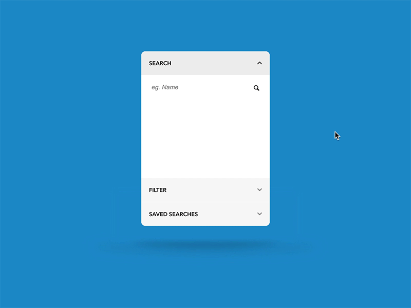
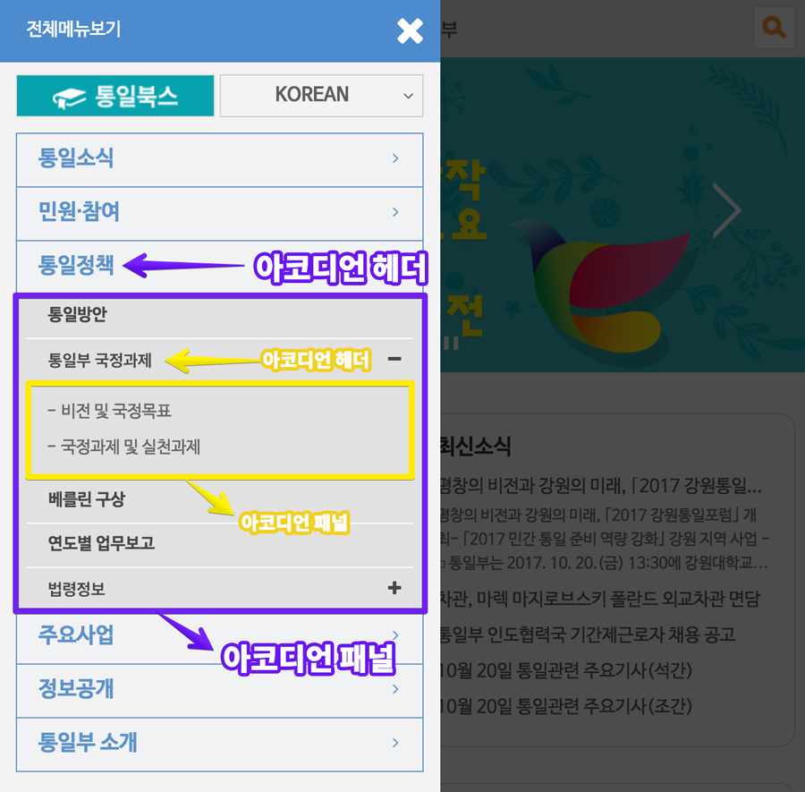

###### Session B
# WAI-ARIA를 반영하여 접근성을 향상시킨 UI 컴포넌트 제작

**아코디언(Accordion) 컴포넌트** 제작 편 by 강사 [야무](https://github.com/yamoo9) | [키노트](http://slides.com/yamoo9/aoa)

Accordion 컴포넌트에 WAI-ARIA 국제표준 기술을 반영하는 과정을 스텝 별로 실습하며 커스텀 컴포넌트 접근성 향상 방법을 공부합니다.

## 목차

  - [Acccordion 컴포넌트란?](#acccordion-컴포넌트란)
  - [Accordion 컴포넌트를 구성하는 기본 구조](#accordion-컴포넌트를-구성하는-기본-구조)
  - [Accordion 컴포넌트 접근성 향상을 위한 WAI-ARIA 디자인패턴](#accordion-컴포넌트-접근성-향상을-위한-wai-aria-디자인패턴)
    - [WAI-ARIA 역할(Roles), 속성(Properties), 상태(States)](#wai-aria-역할roles-속성properties-상태states)
    - [키보드 인터랙션](#키보드-인터랙션)
  - [STEP별 실습](#step별-실습)
  - [참고자료](#참고자료)

### Acccordion 컴포넌트란?

**패널 섹션(Panel Section)** 영역을 **펼침**/**감춤 처리하는 컴포넌트**를 말합니다.
일반적으로 수직 방향으로 겹쳐진 요소들의 집합을 말하며, 각 헤더 레이블을 클릭하면 패널 섹션은 펼침되거나 접힘되어 토글 됩니다.
웹/앱 페이지에 하나 이상의 섹션 콘텐츠(Section Contents)를 표시하고자 할 때, 협소한 공간을 효율적으로 활용하기 위해 사용되는 UI 컴포넌트입니다.

 
> Accordion 컴포넌트

### Accordion 컴포넌트를 구성하는 기본 구조

##### - 아코디언 헤더(Accordion Header)

    연관된 섹션 콘텐츠를 펼치거나, 접는 역할을 수행합니다.

##### - 아코디언 패널(Accordion Panel)

    아코디언 헤더와 연관된 섹션 콘텐츠입니다.

 `Accordion 컴포넌트 구조, Netflix`

 

경우에 따라서는 **중첩된 Accordion 컴포넌트 디자인**이 필요한 경우도 있습니다.

아래 웹사이트 좌측 메뉴 예시는 중첩된 형태로 섹션 콘텐츠를 펼치거나 접을 수 있습니다.
가급적 중첩된 형태가 아닌 단순한 형태의 아코디언이 권장되지만, 기획에 따라 중첩된 아코디언을 사용해야 할 경우도 있습니다.

 
`중첩된 Accordion 컴포넌트 구조, 통일부`

<small>[목차로 이동 ↑](#목차)</small>

 

## Accordion 컴포넌트 접근성 향상을 위한 WAI-ARIA 디자인패턴

W3C WAI-ARIA 표준 기술명세서에 아코디언 역할(role)은 제공되지 않습니다. 하지만 적절한 역할, 속성, 상태를 적용하여 접근성이 향상된 아코디언 컴포넌트를 제작할 수 있습니다.

### WAI-ARIA 역할(Roles), 속성(Properties), 상태(States)

> **역할**은 `role` 속성을, **속성** 및 **상태**는 `aria-*` 형태로 속성을 적용합니다.

역할 | 속성/상태 | 사용 가능한 요소 | 설명
--------- | -------------- | ------------- | ------------
presentation | | `div`, `ul`, `dl` 등 | HTML 요소의 본래 역할을 표현으로 변경
heading | | `div`, `h3`, `dt` 등 | HTML 요소를 아코디언 헤더로 사용
 | | `aria-level="3"` | | 섹션 제목(레벨2) 하위에 위치하므로 레벨3 설정
button | | `a`, `button` 등 | 펼침/접힘을 처리하는 아코디언 헤더 내부 버튼 역할 설정
 | | `aria-expanded="true"` | `a`, `button` 등 | 아코디언 패널 펼침(`true`), 접힘(`false`) 상태
 | | `aria-controls="panel_ID"` | `a`, `button` 등 | 연관된 아코디언 패널 `id` 값 설정
 | | `aria-disabled="true"` | `a`, `button` 등 | 아코디언 패널이 펼쳐진 상태여야만 하는 상태 (접힘 X)
region | | `div`, `li`, `dd` 등 | 펼침, 접힘되는 아코디언 패널 영역 역할 설정
 | | `aria-label="heading_ID"` | `div`, `li`, `dd` 등 | 연관된 아코디언 헤더 `id` 값 설정

#### 해설

- 아코디언 헤더(Accordion Header)는 연결된 패널(Accordion Panel)의 제목(레이블, Label) 역할을 수행합니다.
- 아코디언 헤더 버튼은 연결된 패널을 토글(펼침/접힘)합니다.
- HTML에서 제공하는 기본 제목(`h3`), 버튼(`button`) 요소를 사용하지 않을 경우, 제목 역할에 `role="heading"`와 `aria-level="3"`을, 버튼 역할에 `role="button"` 속성을 추가해야 합니다.
- 아코디언 헤더는 내부에 버튼 요소 하나만 포함해야 합니다.
- 아코디언 헤더 버튼과 연결된 패널이 토글되면 버튼은 `aria-expanded` 상태 값이 변경되어야 합니다. (펼침 `true`, 접힘 `false`)
- 아코디언 헤더 버튼은 `aria-controls` 속성에, 연결된 패널 `id` 값을 연결해야 합니다.
- 만약 아코디언 헤더와 연결된 패널이 펼침 상태를 유지하고 접힘이 허용되지 않을 경우, 헤더 버튼에 `aria-disabled="true"` 상태 값이 설정되어야 합니다.
- 아코디언 패널에 해당되는 요소에 `role="region"`을 설정하고, 연결된 헤더 버튼 `id` 값을 패널 `aria-labelledby` 속성 값으로 설정합니다.
  - 만약 동시에 펼쳐지는 패널의 개수가 6개 이상일 경우, `role="region"`을 사용을 피해야 합니다.
  - `role="region"` 역할은 패널이 연결된 헤더 또는 중첩된 아코디언을 포함하는 경우, 스크린리더 사용자가 구조를 이해하는데 유용합니다.

<small>[목차로 이동 ↑](#목차)</small>

 

### 키보드 인터랙션

사용자 편의를 고려하여 키보드로 아코디언 헤더를 탐색하고 패널을 토글할 수 있는 키(Key) 기능을 추가하는 것을 권장합니다.

<table>
  <col width="210">
  <thead>
    <tr>
      <th scope="col">키보드 키</th>
      <th scope="col">설명</th>
    </tr>
  </thead>
  <tbody>
    <tr>
      <td><code>Enter</code> / <code>Space</code></td>
      <td>아코디언 헤더 버튼에 초점이 이동했을 때 키를 누르면 연결된 패널이 토글되어야 합니다. 선택적으로 패널 1개만 확장 가능하거나, 복수로 확장 가능합니다.</td>
    </tr>
    <tr>
      <td><code title="아래 방향 화살표 키">↓</code> (옵션)</td>
      <td>초점이 아코디언 헤더 버튼에 위치했을 때 아래 화살표 키를 누르면 다음 아코디언 헤더 버튼으로 초점을 이동시킵니다. 더 이상 다음이 없을 경우, 처음 헤더 버튼으로 초점 이동합니다.</td>
    </tr>
    <tr>
      <td><code title="위 방향 화살표 키">︎↑︎</code> (옵션)</td>
      <td>초점이 아코디언 헤더 버튼에 위치했을 때 위 화살표 키를 누르면 이전 아코디언 헤더 버튼으로 초점을 이동시킵니다. 더 이상 이전이 없을 경우, 마지막 헤더 버튼으로 초점 이동합니다.</td>
    </tr>
    <tr>
      <td><code>Home</code> (옵션)</td>
      <td>Home 키를 누르면, 초점을 처음 아코디언 헤더 버튼으로 이동시킵니다.</td>
    </tr>
    <tr>
      <td><code>End</code> (옵션)</td>
      <td>End 키를 누르면, 초점을 마지막 아코디언 헤더 버튼으로 이동시킵니다.</td>
    </tr>
    <tr>
      <td><code>ctrl</code> + <code>Page Down</code> (옵션)</td>
      <td>초점이 아코디언 패널 내부 또는 헤더 버튼에 위치한 경우, 다음 헤더 버튼으로 이동시킵니다. 더 이상 다음이 없을 경우, 처음 헤더 버튼으로 초점 이동합니다.</td>
    </tr>
    <tr>
      <td><code>ctrl</code> + <code>Page Up</code> (옵션)</td>
      <td>초점이 아코디언 패널 내부 또는 헤더 버튼에 위치한 경우, 이전 헤더 버튼으로 이동시킵니다. 더 이상 이전이 없을 경우, 마지막 헤더 버튼으로 초점 이동합니다.</td>
    </tr>
  </tbody>
</table>

#### Macbook, Apple 키보드에서 Home, End, Page Up/Down 키를 사용하려면?

Macbook, Apple 키보드의 경우 페이지 단위로 화면을 스크롤하는 Page Up/Down 키가 따로 존재하지 않습니다.
하지만 키만 존재하지 않을 뿐 키보드 좌측 하단에 있는 `fn` 키와 상하 방향(`↑`,`↓`) 키를 조합하여 동일한 기능을 사용할 수 있습니다.
윈도우에서 첫 페이지와 마지막 페이지로 이동하는 `Home` 키와 `End` 키 기능 역시 Macbook, Apple 키보드 `fn` 키와 좌우 방향(`←`,`→`) 키를 같이 누르면 됩니다.

키 이름     | 사용 방법
---------- | -----------
Page Up    |  `fn` + `↑`
Page Down  |  `fn` + `↓`
Home       |  `fn` + `←`
End        |  `fn` + `→`

<small>[목차로 이동 ↑](#목차)</small>

 

### STEP별 실습

1. [아코디언 컴포넌트 구성](./practice/STEP-1__basic/README.md)
1. [중첩된 아코디언 컴포넌트](./practice/STEP-2__nested/README.md)
1. [아코디언 컴포넌트에 WAI-ARIA 적용](./practice/STEP-3__wai-aria/README.md)
1. [아코디언 컴포넌트에 키보드 인터랙션 적용](./practice/STEP-4__keyboard/README.md)
1. [아코디언 컴포넌트 jQuery 플러그인화](./practice/STEP-5__jquery-plugin/README.md)

<small>[목차로 이동 ↑](#목차)</small>

 

## 참고자료

- [Dribbble Accordion Inspiration](https://dribbble.com/tags/accordion)
- [W3C Accordion Design Pattern](https://www.w3.org/TR/wai-aria-practices-1.1/#accordion)
- [W3C Accordion Example](https://www.w3.org/TR/wai-aria-practices-1.1/examples/accordion/accordion.html)
- [SSB BART Group, ARIA Accordion](https://labs.ssbbartgroup.com/index.php/ARIA_Accordion)
- [jQuery Accessible Accordion system, using ARIA](https://a11y.nicolas-hoffmann.net/accordion/)
- [wai-aria-accordion per w3c best practice spec](https://gist.github.com/dfkaye/c865365e4581548d348a5bfcd586c8be)
- [맥북/애플 키보드에서 Home, End, Page Up, Page Down 키 사용하기](http://macnews.tistory.com/4067)

<small>[목차로 이동 ↑](#목차)</small>