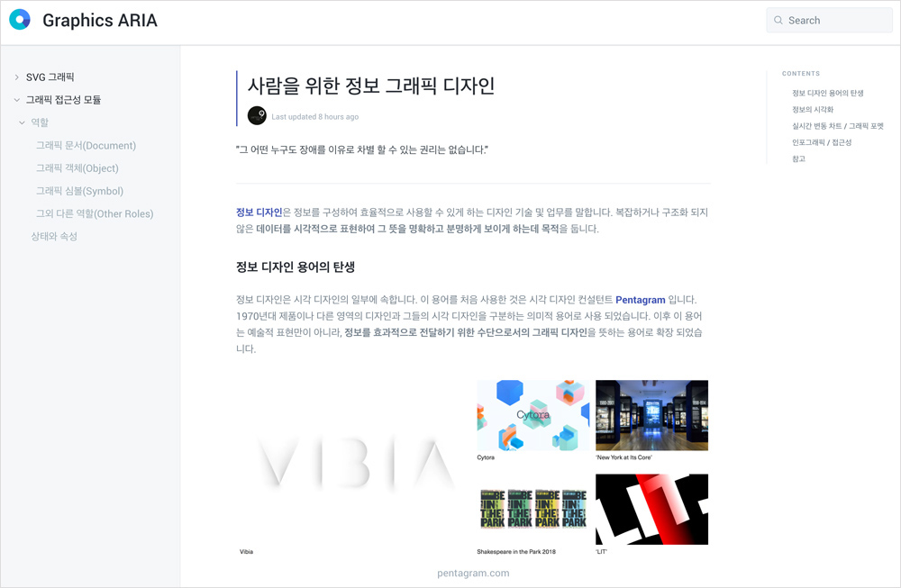

## Graphics ARIA

 
표현이 아닌 정보를 알기 쉽게 제공하기 위한 그래픽 디자인에 접근성을 높이는 방향에 대해 논의해보는 시간을 가져보고,
기존에 논의되던 비트맵 이미지를 넘어 백터 이미지 접근성을 준수하는 방법에 대해 공부해봅니다.

 
 

## Agenda

### 가. 사람을 위한 정보 그래픽 디자인

- 정보 디자인
- 데이터 시각화
- 실시간 데이터 변동에 따른 그래픽 처리
- 벡터 그래픽 접근성 BAD vs GOOD 사례별 연구
- 인포그래픽 참고

### 나. SVG 그래픽

- 벡터 그래픽 포멧
- SVG 마크업
- SVG 접근성
- 사용 예시

### 다. 그래픽 접근성 모듈

- 역할
  - 그래픽 문서
  - 그래픽 객체
  - 그래픽 심볼
  - 그 외 다른 역할
- 속성
- 사용 예시

 

## Presentation

Graphics ARIA E-Book 발표 자료

