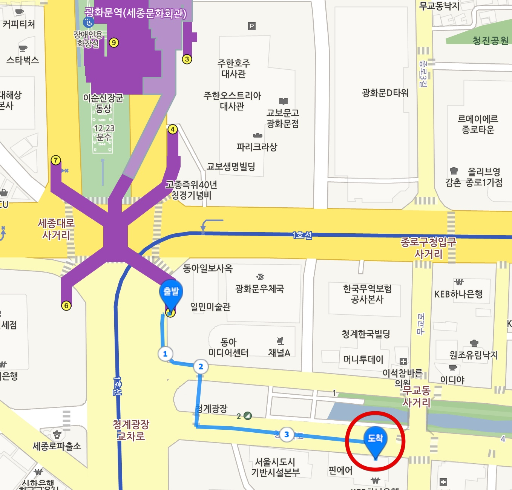

###### 접근성 오픈 아카데미 (AOA, Accessibility Open Academy)

 

 

## 목적

정보접근성 최신기술 교육을 통한 기술 기반 확대로 국제 정보접근성 표준 변화[1](#각주) 및 ICT 환경변화[2](#각주)에 선제적 대응

## 시간표

시 간 | 교육제목 | 강 사 | 소 속
---|---|---|---|
18:40~19:00, 20‘ | 등 록
19:00~19:50, 50‘ | WCAG 2.x 지침을 보완하는 WAI-ARIA 표준 기술에 관한 소개 | 김데레사 | ㈜멀티캠퍼스
19:50~20:00, 10‘ | 휴 식 |||
20:00~20:50, 50‘ | WAI-ARIA 1.x를 반영하여 접근성을 향상시킨 UI 컴포넌트 제작 | 야무 | UA Lab
20:50~21:00, 10‘ | 폐 회

## 일시 및 장소

### 일시
2017 . 10 . 27(금) 19:00~21:00

### 장소
한국정보화진흥원 서울청사 B1층 1회의실

**지하철** 
‣ 1호선 : 시청역 5번출구 → 시청삼거리에서 좌회전(무교로방면) → 서울파이낸스빌딩 옆 
‣ 2호선 : 을지로입구역 1번출구 → 시청삼거리에서 우회전(무교로방면) → 할리스(커피숍) 건너편 
‣ 5호선 : 광화문역 5번출구 → 동아일보사 건너편(약도 참고) 

---

###### 각주

- [1](#목적) : 새로운 웹 접근성 국제표준인 WCAG 2.1의 초안(Working Draft)이 이미 지난 17년 2월 28일에 발표되었으며, 18년 6월 1일 공개(Recommendation)를 목표로 준비 중이다.
- [2](#목적) : 반응형 웹(Responsive Web), 아리아(WAI-ARIA) 등 새로운 웹기술이 정보접근성의 필수적인 요소로 자리매김 할 것으로 예상된다.
